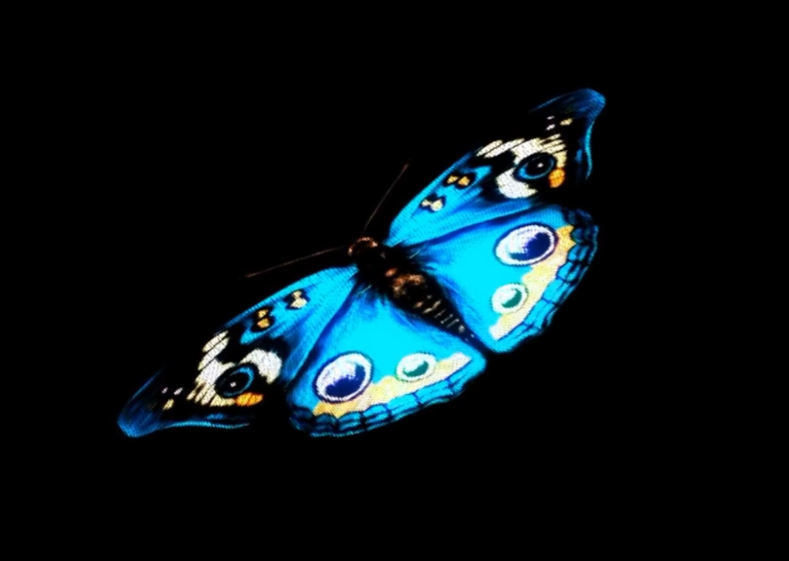
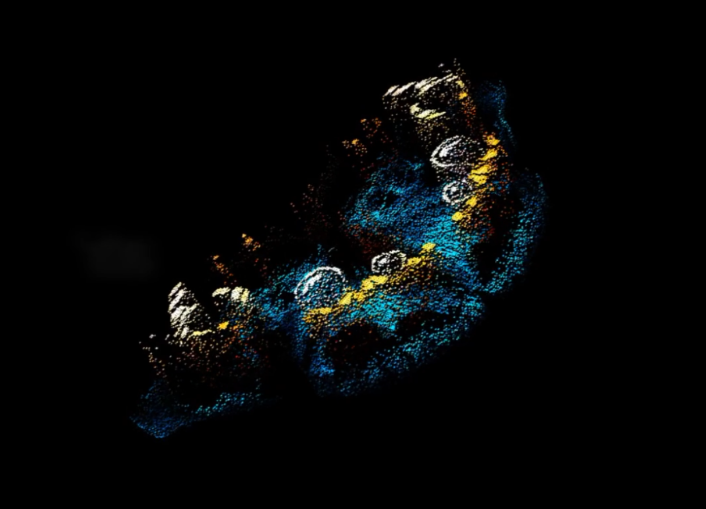
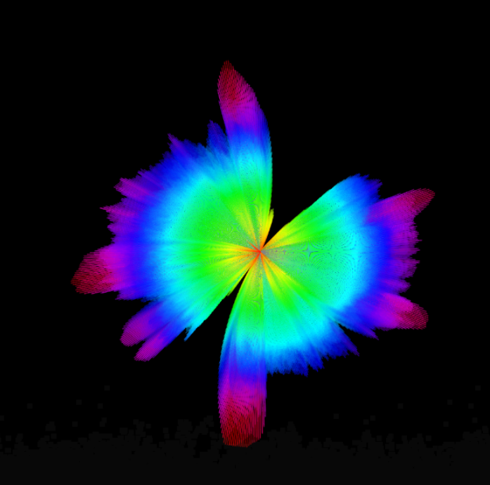
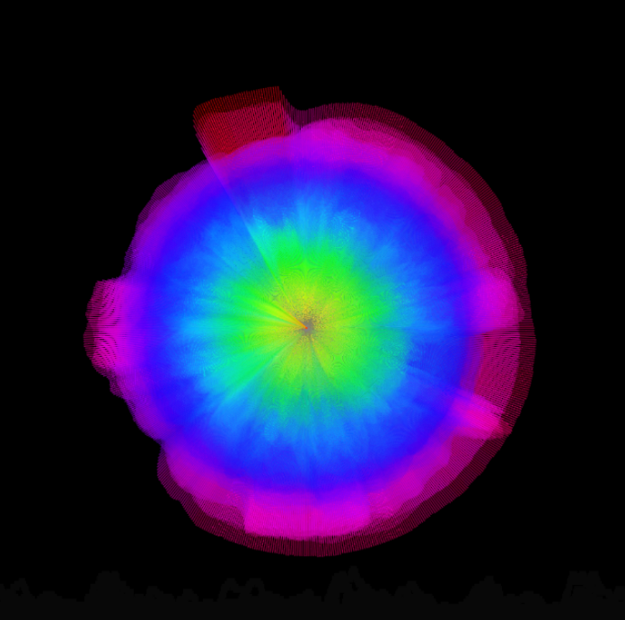

# **Quiz8**

## **Part 1: Imaging Technique Inspiration**
My choice is on Audio Visualization, through the image, [butterfly is composed of countless particles that dynamically change by sound input.](https://www.bilibili.com/video/BV1as4y1N7f7/?spm_id_from=333.788.recommend_more_video.3&vd_source=68ebe7b4dac4b16b61a7855377486938)

- The particles respond to varying sound frequencies and loudnesss, creating an interactive artwork. 

- In the major project, the artwork is generated in real time with sound. The audience's voices make the visual output, greatly enhancing interactivity.Fits the audio direction.

> Before the sound input

> After the sound input

## **Part 2: Coding Technique Exploration**
Use the **`AudioIn( )`** and **`FFT( )`** functions of a simple waveform to analyze the sound input to control the generation of elements, and replace the drawing function with the spawn particle function. ([Particle System](https://editor.p5js.org/p5/sketches/Simulate:_Particle))/([Simple-waveform](https://editor.p5js.org/js6450/sketches/G_I1ETvJp))

- Sound data influences the quantity of particles; soft sounds create fewer particles, loud sounds create more. 

- The artwork's colors are categorized into multiple levels (dark, medium, light), with different sound frequencies guiding the particles to adopt corresponding colors. 

- This creates a dynamic artwork dicided by the sound input's visual effects. 

> Different sound data make different vissual effects.

> The painting is composed of floating particles.